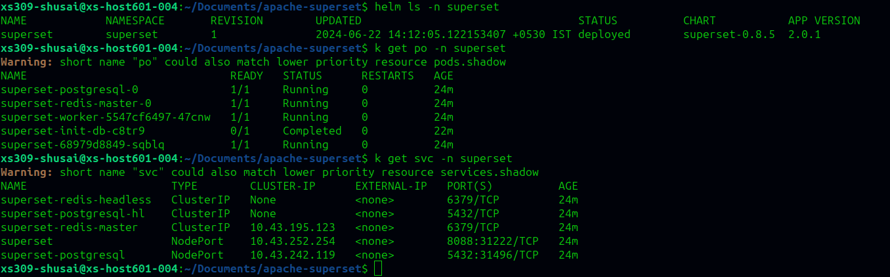
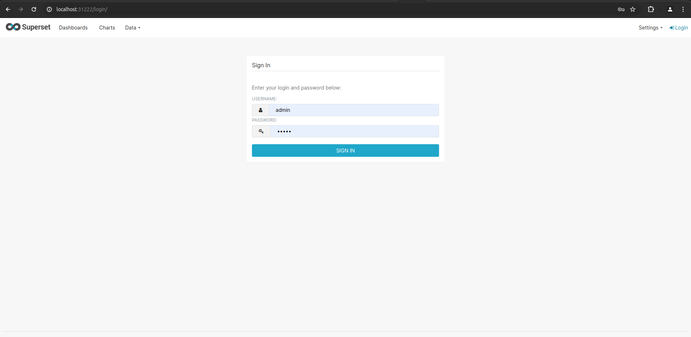
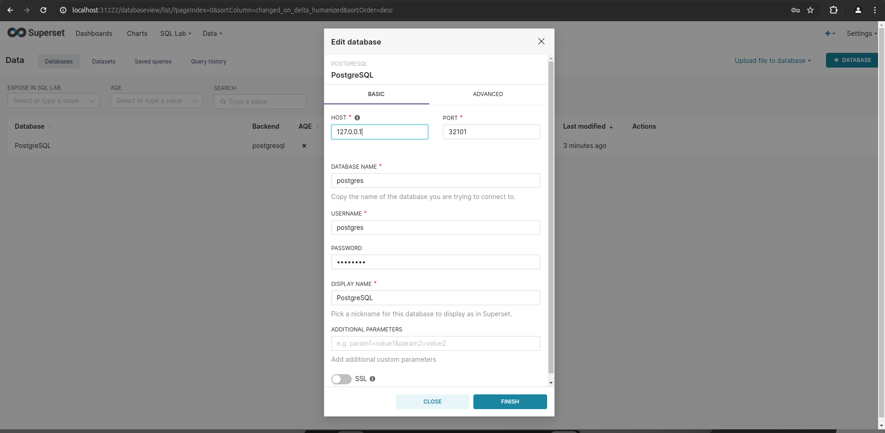
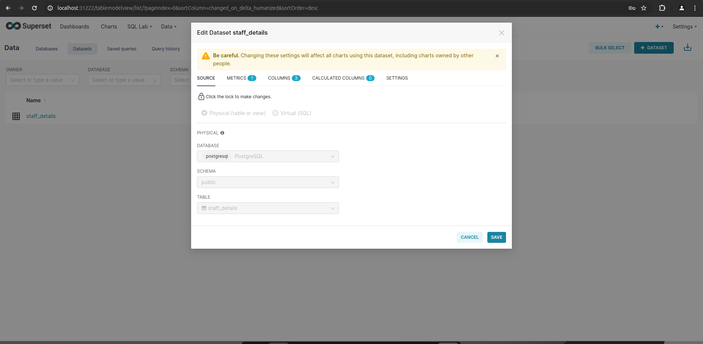
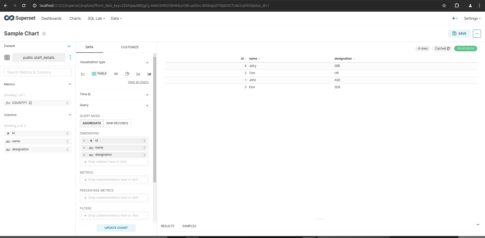
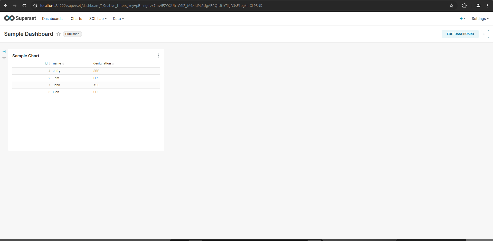

# Apache-Superset

IAC Repo to capture latest working and tested version and config of Apache Superset

---

# Apache Superset Deployment and Cleanup

## Introduction

The repository contains GitLab CI/CD configuration for deploying and cleaning up Apache Superset, a modern data exploration and visualization platform. This readme guides users through the basic steps for deploying and cleaning up Apache Superset in a Kubernetes cluster.

## Deployment Steps and Flow

### Deployment

1. **Namespace Creation**: A Kubernetes namespace named "superset" is created for deploying Apache Superset. Users have the flexibility to customize the namespace or use an existing one according to their needs.

2. **Setting Namespace**: The current context is set to the "superset" namespace.

3. **Helm Repository**: The Apache Superset Helm repository is added from (https://artifacthub.io/packages/helm/superset/superset/0.8.5)


4. **Helm Install**: Install Apache Superset with the desired version.(Recommended- 0.8.5)

5. **NodePort Configuration**: Configure the Apache Superset service to use NodePort and specify the NodePort values for both Superset and the Postgres database.

6. **Access Information**: The Apache Superset dashboard can be accessed on port *31338*, and users can find Postgres connection details on port *32102*. These port numbers can be customized as per the users' requirements.


Kubernetes Cluster - Helm, Pods, Services Status


LOGIN



ADD DATABASE


ADD DATASET


ADD CHART


ADD DASHBOARD


Loom


### Cleanup

1. **Uninstallation**: Apache Superset is uninstalled using Helm, and the initialization job is removed.

2. **Namespace Deletion**: The "superset" namespace is deleted to eliminate all associated resources.


## Customization

Users have the option to customize the deployment by modifying the provided GitLab CI/CD configuration. Customization possibilities include: 
- Changing the namespace name to align with specific requirements.
- Adjusting Helm chart versions(**Version 0.8.5 is recommended**). Note that the latest versions, such as 0.10.9, may have known issues, including:-
    - The job.batch/superset-init-db may not complete and remain stuck in an error state. 
    - The Save and Discard buttons may not be visible in the Superset edit dashboard.
    - Users may experience a login loop after entering credentials.
- To modify the superset_config.py file:
    - While Initial deployment: Make changes in /superset-helm/templates/_helpers.tpl file (Carefully make changes to file content only)
    - When superset already deployed: Make changes to the secert my-superset-config and encode the file with new changes and replace the code in secret for superset_config.py
```console
    apiVersion: v1
    data:
        ...
        superset_config.py: <base64 encoded file content>
        ...
    kind: Secret
    ...
    ...
```


**Note**:  It is essential for users to ensure they have the appropriate permissions and access to the Kubernetes cluster for deploying and cleaning up resources.

## Maintainers

- Subham Saini

Feel free to reach out to the maintainers for assistance or questions related to Apache Superset deployment and customization in Kubernetes environment.

---
